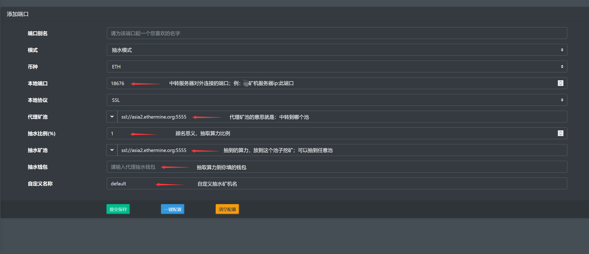
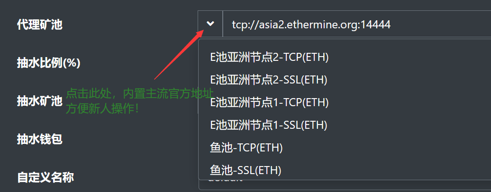

注意！本项目不同于隔壁GoMinerTool，曹操，老矿等！

本地客户端ECRY已上线(加密客户端)
请前往<a href="https://github.com/ethminerpro/ethminerproxy/tree/main/ECRY">https://github.com/ethminerpro/ethminerproxy/tree/main/ECRY</a>自行下载

对于tg上的任何辅助工具，都慎重下载，防止后门！

已内置加密证书，可以自定义ssl证书，在程序目录下放入server.key和server.pem文件即可；

交流电报群https://t.me/trexminerproxy


开发费恒定千三！无论你抽3%还是30%，都是0.3%开发费！

4.0以后版本支持专业机！


# 更新日志
```bigquery
2022-06-29 17:00    5.1.0 >>> 增加专业机抽水精准度
2022-06-16 12:00    5.0.2 >>> 修复：内存越界BUG，运行状态显示不及时
2022-06-15 12:00    5.0.1 >>> 增加加密隧道ECRY，支持本地加密数据
2022-05-26 17:00    4.0.1 >>> 修复4.0.0的NBminer内核，重连问题。
2022-05-25 23:00    4.0.0 >>> 适配专业芯片矿机，优化web后台操作体验，web后台暗黑模式(2.2.1稳定用户可以先观望一段时间)
2022-05-01 01:00    2.2.1 >>> 51国际劳动节快乐！(强烈建议老版本用户更新)
2022-04-30 01:00    2.1.3 >>> 重写中转逻辑、重写抽水逻辑；大幅优化CPU占用、大幅优化抽水算法(抽水更加精准)
2022-04-17 18:00    1.5.2 >>> 优化抽水逻辑，抽水更平稳
2022-04-14 18:00    1.5.1 >>> 优化中转性能、优化内存占用、优化小算力矿机抽水比例
2022-04-08 18:00    1.5.0 >>> 优化抽水算法、优化控制台日志打印、提升性能
2022-04-05 17:00    1.4.2 >>> 修复某些情况下代理抽水异常的BUG、优化逻辑，提升性能
2022-03-30 16:00    1.3.0 >>> 增加服务硬件信息概况、增加矿池延时信息、优化界面、提升性能
2022-03-25 16:00    1.2.0 >>> 增强安全性、增加ETC币种、优化图表展示、性能优化
2022-03-24 17:00    1.1.1 >>> 优化折线图、优化数据展示、优化矿机列表
2022-03-22 23:00    1.1.0 >>> 修复：抽水矿机名问题，曲线图展示问题，端口列表里面显示离线设备数量
2022-03-15 19:00    1.0.0 >>> 第一个版本发布
```
# windows版本下载:
[点击下载 ](https://github.com/ethminerpro/ethminerproxy/raw/main/ethminerproxy_windows.exe) 。


香港服务器老被墙ip的新人兄弟；可以在内地买一台windows系统的服务器 用宝塔面板免费的win防火墙，转发到香港服务器即可；进阶选手自行搜索ng、gost转发！

# 新增linux一件脚本安装
```
bash <( curl -s -L https://raw.githubusercontent.com/ethminerpro/ethminerproxy/main/install.sh )
```

# 简易设置教程



## 重要说明
```bigquery
为了安全，对外必须开启ssl端口
开发者抽水恒定0.3%！！目前运行最稳定的软件；欢迎实测！
不建议抽太多，做到可持续发展，托管时请一定告知客户存在托管费


4核心8G内存的搬瓦工，带机3000台，测试4天，机器稳定不掉线
```

# 如果你算力不准：
①第一检查挖矿软件配置及内核配置，是否设置超过多少分钟没有成功提交重启内核

②查看你服务器的硬件配置及软件带宽，配置过低可能导致转发性能不足，导致重发及超时

③检查你服务器的网络是否占用超过60%以上，是的话加带宽




## 其他
ETHminerproxy已上线数月之久，经过大量测试研究发现使用 Debian/Ubuntu 操作系统更加稳定，Centos 已停止更新。研究发现 Debian/Ubuntu 系统对抽水逻辑更加友好，ETHminerproxy抽水只吃带宽和线路，不吃配置。最新版已针对操作系统做了内置TCP/SSL稳定优化和加速。

ETHminerproxy绝无暗抽，良心实打实，多少开发费就是多少开发费，一分价钱一分货，可接受任何第三方抓包测试。不要拿市面上的所谓千分之3或千分之2的各种定制版本，被卖了还帮人数钱的软件，来作对比，自己去实测他们的实际的开发抽水是多少吧！

我们的一贯的原则：稳定好用你就用，不好用你就不用，从不强求，也不会到处打广告，只做良心精品！
ETHminerproxy不吃配置，不爆cpu和内存，低流量，后台反应迅速，已优化到极致，大算力及矿场首选，接受一切测试。

托管时请一定告知客户存在托管费，不要抽大动脉，做到可持续发展！
